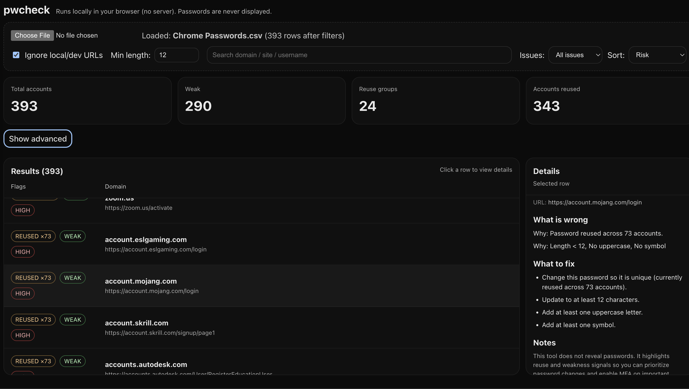

# pwcheck

A local-only password hygiene dashboard that helps you **spot password reuse** and **weak password patterns** across the accounts in your exported password CSV without ever showing passwords on screen.



## What it does

pwcheck analyzes your exported password list and highlights:

- **Reuse**: the same password used across multiple accounts (shown as `REUSED xN`)
- **Weakness signals**: simple policy checks like minimum length and missing character types (shown as `WEAK`)
- **Risk**: a basic, explainable score used to sort/prioritize what to fix first

Everything runs **in your browser**. There’s **no server** and no network calls required.

## Privacy / safety

- **Runs locally** (browser-only, no backend)
- **Passwords are never displayed**
- Use **Demo mode** (Advanced) to mask domains/usernames if you want to take screenshots

## Input format

pwcheck expects a CSV with these headers:

- `name`
- `url`
- `username`
- `password`
- `note`

> Tip: If your export uses different column names, rename them to match the above (lower/upper case doesn’t matter).

## How to use

1. Export your passwords from your browser or password manager as a CSV
2. Open pwcheck
3. Upload the CSV (or drag-and-drop it onto the page)
4. Use filters + sorting to triage:
   - **Issues**: All / Reuse only / Weak only
   - **Sort**: Risk / Reuse count / Domain
5. Click a row to view details:
   - “What is wrong”
   - “What to fix”

## Controls

- **Ignore local/dev URLs**: hides localhost / private network entries
- **Min length**: your minimum length policy (updates “Why” + fix suggestions)
- **Search**: filters by domain/site/username
- **Show advanced**
  - **Demo mode**: masks domain + username + URL display for safe screenshots
  - **Raw CSV preview**: debugging-only (avoid sharing screenshots with this on)

## Development

### Install & run

```bash
npm install
npm run dev
```
Then open the local URL shown in your terminal (usually http://localhost:5173).

### Build

```bash
npm run build
npm run preview
```

### Notes on “Risk”

Risk is intentionally a simple heuristic (reuse count + weakness signals) so it’s easy to understand and sort by. It’s meant for prioritization, not as a security certification.

## License
MIT License © 2026 Shane Simes
